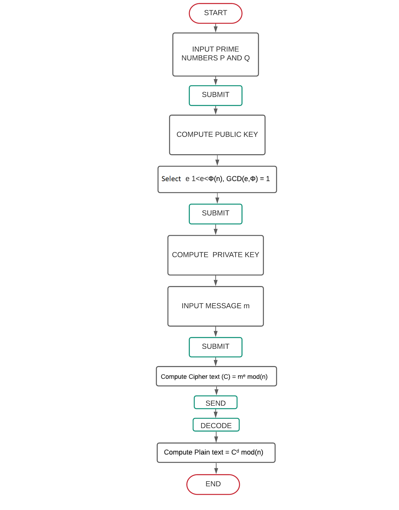

## Storyboard (Round 2)

Experiment 3: Write a Java Program to implement RSA algorithm.

### 1. Story Outline:

The experiment is based on implementation of RSA algorithm for encryption and decryption of message using asymmetric encryption.
RSA is the initial letters of the surnames of Ron Rivest, Adi Shamir, and Leonard Adleman, who publicly described the algorithm in 1977.The experiment involves generating the public key and private key using two large prime numbers entererd by user and then using the calculated key pairs to encrypt the message and decrypt the message.
The user choses two large prime numbers for P and Q.This evaluates some value of e which then plays a vital role in calculation of Public key and Private key.This is then followed by user entering the message to be encrypted,sending the message to the reciever and then again decrypting it to plain message.Simulator will provide the user a better understanding of the overall procedure involved in RSA algorithm implementation.

### 2. Story:

RSA (Rivest–Shamir–Adleman) is one of the first public-key cryptosystems and is widely used for secure data transmission. The acronym RSA is the initial letters of the surnames of Ron Rivest, Adi Shamir, and Leonard Adleman, who publicly described the algorithm in 1977. In such a cryptosystem, the encryption key is public and distinct from the decryption key which is kept secret (private). In RSA, this asymmetry is based on the practical difficulty of factoring the product of two large prime numbers.
A user of RSA creates and then publishes a public key based on two large prime numbers, along with an auxiliary value. The prime numbers must be kept secret. Anyone can use the public key to encrypt a message, but only someone with knowledge of the prime numbers can decode the message.
The RSA algorithm involves four steps: key generation, key distribution, encryption and decryption.
A basic principle behind RSA is the observation that it is practical to find three very large positive integers e, d and n such that with modular exponentiation for all integers m (with 0 ≤ m < n), and that knowing e and n, or even m, it can be extremely difficult to find d. 
RSA involves a public key and a private key. The public key can be known by everyone, and it is used for encrypting messages. The intention is that messages encrypted with the public key can only be decrypted in a reasonable amount of time by using the private key. The public key is represented by the integers n and e; and, the private key, by the integers d and n.
In Java we use Big Integers for calculating the above mentioned values and some algorithmic functions are to be created for fully implementing the algorithm.

#### 2.1 Set the Visual Stage Description:

We divide our whole simulator into two parts.The top part comprises the instructions for the simulator and the bottom part is for simulator actions which is further subdivided into simulator representation part and code display part.The home screen shows 2 text boxes for entering values into P and Q.On submitting the form vanishes and is replaced by the form for inputting value of e. Then the details about P, Q, Phi, n and Public-Private key pairs are displayed.
The message to be sent for encryption is to eneterd now in the text box displayed.On submitting a message box with encrypted message and send button is displayed.On clicking send the message is sent to the reciever and displayed on recieving side with a Decrypt button.The decrypt button will decrypt the message and retrieve the plain text.
The side panel continously shows the appropriate code running for the ongoing process.

#### 2.2 Set User Objectives & Goals:

1. The prime objective of this experiment is to demonstrate the process of Encryption and Decryption using RSA algorithm. 
2. The simulator visually shows every step so that user may better understand the logic behind the process. 
3. To depict the process of public key and private key generation. 
4. To display the different scenarios on chosing different values of P and Q. 
5. To answer the assesment based on the observations. 

#### 2.3 Set the Pathway Activities:

1. User has to provide two large Prime numbers for P and Q in the text boxes provided. 
2. Click on Submit and the appropriate value of e is displayed to be chosen from a list. 
3. Click on Submit and the details about P and Q is displayed. 
4. Public key and Private key is also calculated using given formulae and displayed then. 
5. The message to be sent should be entered now in the "Enter message" text box. 
6. Click on Encrypt button and message is encrypted using given formulae and displayed on sender's end. 
7. Click on Send button to send the message to the reciever. 
8. Click on Decrypt button to decrypt the recieved messsage. 
9. The sent message is displayed on reciever's end. 

##### 2.4 Set Challenges and Questions/Complexity/Variations in Questions:

Q. Dexter wants to set up his own public and private keys. He chooses p = 23 and q = 19 with e = 283. Find d? 
A.11 
B.<b>7</b> 
C.37 
D.19 

Q. For p = 11 and q = 19 and choose e=17. Apply RSA algorithm where message=5 and find the cipher text? 
A.92 
B.<b>80</b> 
C.67 
D.39 

##### 2.5 Allow pitfalls:

1. The simulator is designed for particularly smaller messages and therefore student needs to be attentive while choosing the message to be sent. 
2. The student have a great opportunity to try different prime number combinations to implement RSA. 
3. The student need to enter different prime numbers for P and Q so attention is needed here or conclusion may differ thereafter.

##### 2.6 Conclusion:

1. Assessment/evaluation of the pre-test and post-test should be given immediately to the user. The moment the student clicks on the answer of his choice, the CORRECT ANSWER should be displayed below the question. This would enable the student to understand whether he is right or wrong. 
2. This would prompt the users as to how many answers were correctly answered. 
3. The given plain text is to be encrypted using RSA and then answered accordingly. 
4. The given Cipher text is to be decrypted using RSA and then answered accordingly. 

##### 2.7 Equations/formulas: 

n = P x Q where P,Q are two large Prime numbers 
&Phi; = P-1 x Q-1  
e = i such that GCD(i,&Phi;)=1  
d = (k x &Phi; + 1)/e for some integer k  
Cipher text = message^e modulus n  
Plain text = Cipher^d modulus n  

### 3. Flowchart 

 

### 4. Mindmap:

### 5. Storyboard :

